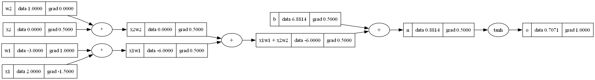
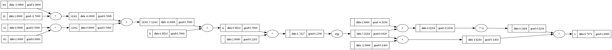

# Micrograd From Scratch

A learning implementation of **Andrej Karpathy's Micrograd**, built from scratch to understand how **reverse-mode automatic differentiation**, **backpropagation**, and **neural networks** work under the hood.

Instead of treating `loss.backward()` as a black box, this project explores the complete implementation of an autograd engine from first principles.

---

## Project Objective

The objective of this project is **not to build another deep learning framework**, but to gain an intuitive understanding of:

- Computational Graphs
- Reverse-Mode Automatic Differentiation
- Chain Rule
- Backpropagation
- Gradient Flow
- Neuron Computation
- Multi-Layer Perceptrons (MLPs)

---

# Features

- ✅ Custom `Value` class
- ✅ Dynamic Computational Graph
- ✅ Reverse-Mode Automatic Differentiation
- ✅ Topological Sorting
- ✅ Automatic Backpropagation
- ✅ Gradient Accumulation
- ✅ Mathematical Operations
  - Addition
  - Multiplication
  - Subtraction
  - Division
  - Power
  - Exponential
- ✅ tanh Activation Function
- ✅ Custom Neuron Implementation
- ✅ Layer Implementation
- ✅ Multi-Layer Perceptron (MLP)

---

# Computational Graph

The computation graph stores every mathematical operation performed during the forward pass.

It allows gradients to flow backward efficiently using the Chain Rule.



---

# Expanding tanh into Primitive Operations

Instead of using `tanh()` directly, it can also be represented using exponential operations.

This graph demonstrates how activation functions themselves become part of the computational graph.



---

# How Backpropagation Works

1. Build the computational graph.
2. Perform the forward pass.
3. Create a topological ordering of the graph.
4. Traverse the graph in reverse order.
5. Apply the Chain Rule.
6. Compute gradients.
7. Update parameters.

---

# Concepts Learned

During this implementation I gained an intuitive understanding of:

- Reverse Mode Automatic Differentiation
- Computational Graphs
- Chain Rule
- Gradient Accumulation
- Topological Sorting
- Automatic Backpropagation
- Neural Network Internals
- Weight & Bias Updates
- PyTorch Autograd Internals

---

# 🛠️ Technologies Used

- Python
- Jupyter Notebook
- Graphviz
- Math Library

---

# Repository Structure

```
micrograd_from_scratch/
│
├── micrograd.ipynb
├── images/
│   ├── backpropagation_graph.png
│   └── tanh_expansion_graph.png
└── README.md
```

---

# Why I Built This

The purpose of this project was to understand **what happens behind the scenes** when frameworks like **PyTorch** execute:

```python
loss.backward()
```

Instead of simply using deep learning libraries, I wanted to understand the mathematics and implementation behind automatic differentiation.

---

# Acknowledgements

This project is inspired by the excellent educational work of **Andrej Karpathy**.

Original Repository:

https://github.com/karpathy/micrograd

All credit for the original idea and educational content goes to Andrej Karpathy.

This repository is my personal learning implementation created while studying Deep Learning fundamentals.

---

# ⭐ If you like this project

Consider giving the repository a ⭐.
